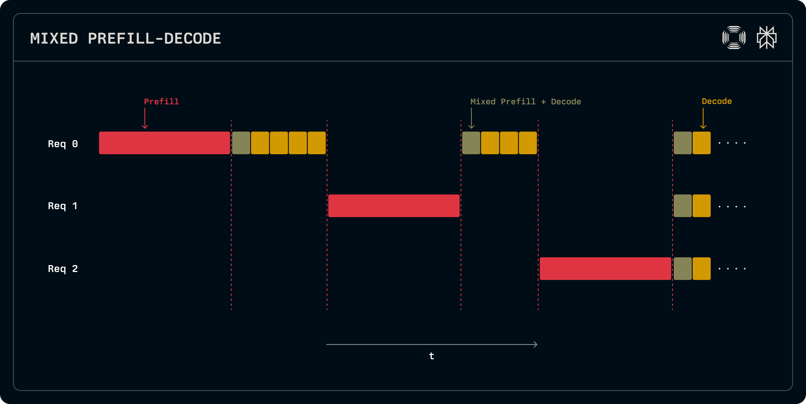
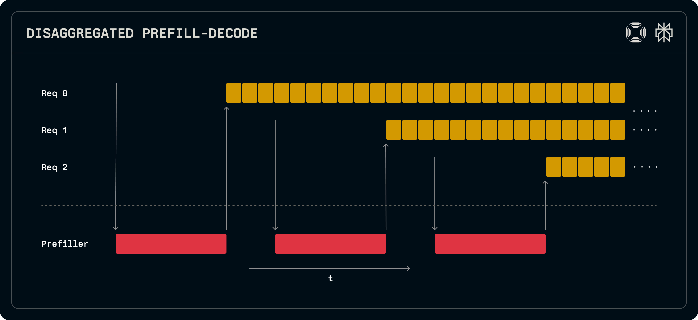
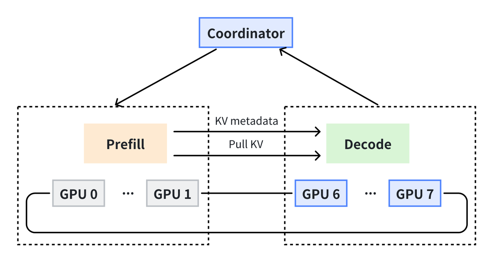
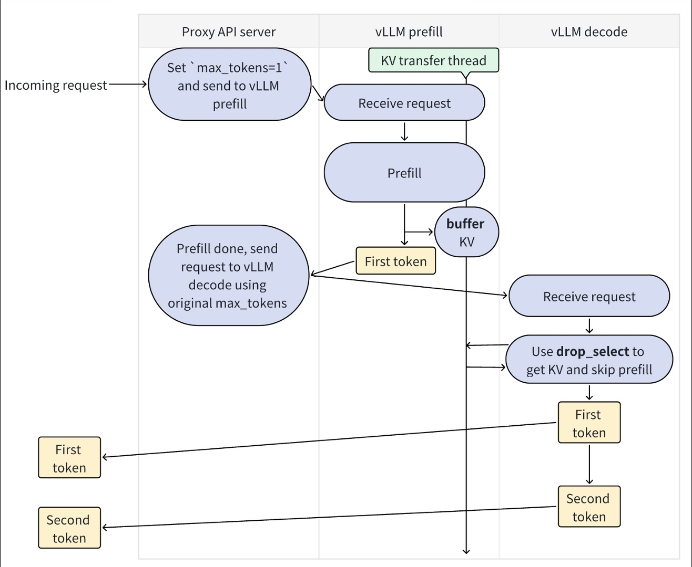

好久沒更新技術日誌，趁過年空檔把腦袋裡的知識點補一補 XD

LLM 推理的核心挑戰是什麼？

隨著模型參數持續拓展，推理成本、延遲和 GPU 利用率成為服務化的關鍵瓶頸。研究者們逐漸發現：LLM 推理是由兩個性質完全不同的階段構成——Prefill（計算密集）和 Decode（記憶體密集），分離檢視可開啟新的優化路徑。

本文將用務實的角度，帶你理解 **Prefill-Decode 分離架構**：為什麼把推理拆成兩段，能在顯存、延遲和成本上找到新的優化機會。

---

**看完這篇你將學習到：**

1. LLM 推理的兩個階段（Prefill vs Decode）以及本質差異
2. **為什麼考慮分離部署**：資源需求不匹配的問題
3. 分離能帶來的主要好處：更有效的 batching、成本與延遲優化
4. **KV Cache 的核心作用**：以存換算的概念與挑戰
5. 什麼情境適合或不適合做 PD 分離，以及常見實作選擇（如 vLLM、llm-d）

---

## LLM 推理的兩個階段：Prefill vs Decode

### 什麼是 Prefill 和 Decode？

當我們向 LLM 提問時，模型的推理過程分為兩個階段：

```
使用者輸入："請幫我總結這篇 5000 字的文章..."

┌─────────┐          ┌─────────┐
│ Prefill │    →     │ Decode  │
└─────────┘          └─────────┘
處理整段輸入 tokens   逐字生成回答
   (一次性)      (auto-regressive)
```

- **Prefill 階段**：處理使用者輸入的所有 token，建立初始的 KV Cache
- **Decode 階段**：基於 Prefill 建立的 KV Cache，逐個生成回答的 token

這兩個階段看起來相似，但在計算特性上不完全相同。

---

### Prefill：計算密集型（Compute-Bound）

**核心特點**：
- 需要處理整段輸入序列（例如 5000 tokens）
- 每個 token 都要和前面所有 token 計算 Attention
- Attention 複雜度：**O(n²)**，其中 n 是序列長度
- 可以**並行處理**所有 token
- GPU 算力利用率高

以一個具體例子來看：

```
Input: "請幫我總結這篇 5000 字的文章..." (5000 tokens)

Prefill 計算過程：
├─ Token 1 → 計算與自己的 Attention
├─ Token 2 → 計算與 Token 1, 2 的 Attention
├─ Token 3 → 計算與 Token 1, 2, 3 的 Attention
├─ ...
└─ Token 5000 → 計算與前面 5000 個 tokens 的 Attention

總計算量：1 + 2 + 3 + ... + 5000 （呈 O(n²) 增長）
```

簡單來說，當序列變長時，Prefill 的計算量會迅速增加，但因為這些運算可以被大量並行，GPU 通常會被高度利用。

---

### Decode：記憶體密集型（Memory-Bound）

**核心特點**：
- 每次只生成**一個** token（auto-regressive）
- 必須**按照順序生成**（無法並行）
- 計算量很小，但需要頻繁讀取模型權重和 KV Cache
- GPU 算力利用率低

```
生成回答："根據│文章│內容│，│主要│觀點│是│..."
          ↑
    每次只生成一個 token

每一步 Decode：
├─ 讀取模型權重（70B 模型 ≈ 140 GB）
├─ 讀取 KV Cache（可能數 GB）
├─ 計算新 token 的 Attention（計算量小）
└─ 生成一個 token

瓶頸：記憶體頻寬
```

- Decode 每步運算少，但需要頻繁讀寫權重與 KV cache，導致記憶體成為主要瓶頸。
- 無法將多個步驟合併提升算力利用率；即便 GPU 有空閒也難以被用上。
- 在即時回應場景，這些記憶體延遲會直接變成使用者可見的等待時間。

---

### 對比總結

| 階段          | 資源需求特性     | 計算模式            | 顯存佔用模式     | 目的                 |
| ----------- | ---------- | --------------- | ---------- | ------------------ |
| **Prefill** | **計算密集型**  | **高並行度**，矩陣乘法為主 | 低，固定規模     | 模型讀取並「理解」你輸入的所有上下文 |
| **Decode**  | **記憶體密集型** | **順序生成**，存取為主   | 隨上下文增長指數上升 | 模型基於已有資訊逐步生成回應內容   |

**Prefill** 是使用者輸入完 prompt 到產生首個 token 的過程，**Decode** 則為產生其它 token 到推理停止的過程。

那麼，這樣我們就很好理解，為什麼 LLM 的推論過程不是一個階段，而是拆分成兩個階段進行的原因：

1. 輸入 prompt 是完整的、一次性提供的，**適合並行計算**。
2. 輸出 token 是未知的，只能 **一個一個推論，必須順序生成**。

這兩個階段的資源需求不同，將它們運行在同一個 GPU 上，可能難以同時發揮最佳效能與資源利用率。

---

## 為什麼考慮 Prefill-Decode 分離？

> 專有名詞: **Prefill-Decode disaggregation (PPD)** 可翻成 **預填解碼分離**。

當我們理解了 Prefill 和 Decode 這兩個階段的本質差異後，一個有趣的觀察浮現了：**這兩個階段的資源需求不同——一個吃算力、一個吃記憶體頻寬。**

把它們綁在同一個 GPU 上，會不會像是讓兩個需求完全不同的任務搶同一份資源？分開來會不會有機會各自發揮？還是反而增加複雜度得不償失？

### 傳統架構的觀察：一個 GPU 同時處理兩種工作負載
在傳統整合式架構中，Prefill 和 Decode 運行在同一個 GPU 上。

**傳統混合架構（Mixed Prefill-Decode）**：



如圖所示，三個用戶請求（Req 0, 1, 2）的 Prefill（紅色）和 Decode（黃色）混雜在一起：

- Req 1 的 Prefill 必須等 Req 0 處理完才能開始
- Decode 階段互相干擾，無法穩定並行
- GPU 資源難以針對單一階段優化

### 分離的想法：專用處理器各司其職

**分離架構（Disaggregated Prefill-Decode）**：


分離後的架構將工作負載分成兩層：

- **上層（Decode 專用）**：所有請求的 Decode 可以並行執行，互不干擾
- **下層（Prefiller 專用）**：批次處理多個 Prefill 請求，專注高算力運算

**對比可以看出**：

- Prefill 不用排隊（下層獨立批次處理）
- Decode 更穩定（上層不會被 Prefill 打斷）
- ⚠️ 但需要處理 KV Cache 傳輸（箭頭）

### 分離理論上可能帶來的改善

#### 1. 批次處理策略分離

Prefill 和 Decode 可以各自使用最佳的 batch size：

```
Prefill GPU: 收集 100 個請求批次處理 → 算力利用率提升
Decode GPU: 處理 50 個並行生成 → 穩定輸出
```

#### 2. 資源配置靈活化

Decode 算力需求低，可以用更多便宜的小 GPU：

```
可能配置：
├─ 2 台 H100 (Prefill 專用)
└─ 20 台 L4 (Decode 專用)

需考量：成本 vs KV 傳輸開銷
```

#### 3. 延遲優化

新請求不會被長時間阻塞：

```
分離前：[Prefill A] → [Decode A 生成 1000 tokens] → [Prefill B] ← B 等很久
分離後：Prefill 和 Decode 並行處理 → 新請求快速開始
```

#### 4. 算法優化空間

不同階段有各自的優化技術：
- **Prefill**：FlashAttention、Tensor Parallelism
- **Decode**：KV Cache、Speculative Decoding

> 這些優化技術各自都是一個坑，之後有機會再專門寫一篇深入探討。

---

## 核心技術：KV Cache

### 以存換算的概念
回想一下 Decode 階段的運作方式：模型每次生成一個新 token 時，都需要計算這個 token 和之前所有 token 的 Attention。問題是如果不做任何優化，會發生什麼事？

想像你正在生成一段 1000 字的回答：

```
生成第 1 個字「我」時：
└─ 計算 [輸入] + "我" 的 Attention

生成第 2 個字「是」時：
└─ 又要重新計算 [輸入] + "我" + "是" 的 Attention
    ↑ 剛才算過的 [輸入] + "我" 又算了一次

生成第 1000 個字時：
└─ 前面 999 個字的 Attention 又要全部重算一次
```

這樣累積下來，總計算量是 `1 + 2 + 3 + ... + 1000 ≈ 500,000 次`。而這些計算中，絕大部分都是**重複的**——我們一次次重新計算已經算過的東西。

**KV Cache 的解法：以存換算**

既然歷史 token 的 Attention 結果已經固定，我們就把它保存下來直接重用，這就是 KV Cache 的簡單概念：

```
第 1 次生成「我」：計算並緩存 "我" 的 K、V
第 2 次生成「是」：重用緩存，只計算 "是" 的 K、V
第 1000 次：重用緩存，只計算新字的 K、V

總計算量：1000 次（節省了 99.8%！）
```

這個優化帶來的效果是驚人的——**從 50 萬次計算降到 1000 次，節省了 500 倍的運算量**。這也是為什麼現代 LLM 推理引擎都會預設啟用 KV Cache。

---

### Q, K, V 的含義

在 Attention 機制中，我們可以用搜索引擎來類比：

```
搜索詞: "機器學習教程"  ← Query (Q)

搜索結果:
├─ 文章1: 標題="機器學習入門"  ← Key (K)
│          內容="介紹監督學習..."  ← Value (V)
│
├─ 文章2: 標題="深度學習基礎"  ← Key (K)
│          內容="神經網路原理..."  ← Value (V)
```

**Attention 計算過程**：
1. **Q·K**: 搜索詞和每篇文章標題的匹配度
2. **Softmax**: 轉換成注意力權重（代表哪篇文章最相關）
3. **權重·V**: 根據權重加權平均文章內容

 **Q** 是當前正在生成的 token，每次都不同；而 **K** 和 **V** 代表歷史 token 的表示，一旦計算完就固定了。所以我們只需要緩存 K 和 V，每次用新的 Q 去查詢就好。

---

### KV Cache 增長問題

聽起來 KV Cache 解決了所有問題？沒那麼簡單。
KV Cache 有個致命的問題：**它會隨著生成不斷增長**。每生成一個新 token，就要往 Cache 裡加一筆資料，長期下來會累積成龐大的記憶體與傳輸負擔。

而這份持續膨脹的 KV Cache，正是 Prefill-Decode 分離架構中核心的傳輸負擔。當 Prefill 和 Decode 運行在不同 GPU 上時，這份動輒數 GB 的數據必須在它們之間高效傳輸，傳輸成本決定了分離架構是否划算。這也引出了我們的下一個主題：分離架構下的通訊挑戰。

接下來，我們將具體檢視 PD 分離架構下的通訊挑戰與適用場景。

---

## PD 分離架構與通訊挑戰

### 基本架構：三個核心組件

當我們決定把 Prefill 和 Decode 分開後，實際上需要三個核心組件：


```yaml
┌─────────────────────┐
│  Proxy API Server   │ ← 控制平面（HTTP/gRPC）
└──────────┬──────────┘
           │
     ┌─────┴─────┐
     │           │
     ▼           ▼
┌─────────┐  ┌──────────┐
│ Prefill │  │  Decode  │
│ Instance│  │ Instance │
└────┬────┘  └─────▲────┘
     │             │
     └─────────────┘
      KV Cache 傳輸
     (NCCL/NIXL)
```

**工作流程**：
1. Proxy 接收用戶請求，路由到 Prefill Instance
2. Prefill 處理輸入，生成 KV Cache 和第一個 token
3. 異步傳輸 KV Cache 到 Decode Instance
4. Decode 接收 KV，繼續生成後續 tokens
5. Streaming 返回結果給用戶

---

### Prefill-Decode 分離通訊協定

PD 分離讓 prefill 與 decode 階段分別運作在不同的 worker 上（甚至不同節點上），實現更靈活的資源編排。
但 PD 分離帶來的挑戰是：prefill 輸出的 **KV Cache（注意力緩存）** 要傳遞給 decode worker，這需要高效率的 **跨裝置通訊協定**。

**NCCL (NVIDIA Collective Communication Library)** 是 NVIDIA 官方的 GPU 間通訊庫，專為高頻寬環境設計：

- **適用場景**：同機或同網段的 GPU（NVLink/NVSwitch 環境）
- **優勢**：延遲低、頻寬高，傳輸快
- **限制**：只能在 GPU 直連或高速互聯環境下使用

如果你的 Prefill 和 Decode 都在同一個機房、同一個 GPU 集群，NCCL 是最佳選擇。

**NIXL (NVIDIA Interconnect eXtension Layer)** 是 NCCL 的遠端擴展層，專為跨節點通訊設計：

- **適用場景**：跨節點、異質 GPU 集群
- **特點**：支援 InfiniBand、Ethernet 等網絡
- **目標**：降低跨節點 KV Cache 傳輸延遲
- **權衡**：比 NCCL 慢，但更靈活

可以理解為：**NIXL = 面向推理系統的「遠端 NCCL」**

---

### PD 分離適合什麼場景？

理解了架構和挑戰後，一個實際問題是：**什麼時候應該考慮 PD 分離？**

**可能適合的場景**：
- **高吞吐批處理**：大量並發請求，長序列生成任務
- **資源異質環境**：有不同規格的 GPU，希望分別利用
- **願意接受傳輸成本**：用 KV 傳輸換取更靈活的資源配置與延遲優化

**可能不適合的場景**：
- **極低延遲要求**（< 100ms TTFT）：KV 傳輸可能成為瓶頸
- **小規模部署**：單機 vLLM 的 Continuous Batching 已經相當高效
- **網絡條件限制**：跨地域部署會讓傳輸延遲過高

**核心思考**：
PD 分離不是「更好的架構」，而是一種**工程權衡**。它用傳輸成本和複雜度換取資源靈活性，適合特定場景而非通用解。

到這裡，我們已經理解了 PD 分離架構的完整運作流程、挑戰，以及適用場景。

接下來看看實際的實現方案。

---

## 實現方案：從 vLLM 到 llm-d

前面我們討論了 PD 分離的架構和挑戰，但實際上要怎麼實作呢？

### vLLM 的 PD 分離實現



vLLM 從 0.4.0 版本開始支援 Disaggregated Prefilling，核心思路就是前面提到的三層架構：Proxy 負責路由、Prefill Instance 處理輸入並生成 KV Cache、Decode Instance 接收 KV 並生成 tokens。

**但這個功能目前標記為 Experimental**，原因是配置複雜度相當高：

- 需要手動啟動並維護兩個獨立的 vLLM 實例
- 自己實現 Proxy Server 處理請求路由
- 配置第三方 KV Transfer Connector（PyNccl 或 Mooncake）
- 處理負載均衡、故障恢復、監控告警等生產問題

換句話說，**vLLM 提供了底層能力，但編排層需要自己搭建**。對於想在生產環境大規模使用 PD 分離的團隊來說，這個門檻並不低。

---

### llm-d：簡化 PD 分離部署

因為 vLLM 的 PD 分離配置複雜、缺少生產級的編排能力，llm-d 項目應運而生。

**llm-d 是什麼？**

llm-d 是建立在 vLLM 之上的**編排和管理層**，目標是簡化 PD 分離的部署和運維。

**核心特點**：
- **Kubernetes-native**
- **自動化運維**：內建 Proxy、負載均衡、故障恢復
實際上 llm-d 的運作和架構等到下一篇再繼續了！今天就先停在 Prefill-Decode 架構的理解就好。

---

## 長上下文時代的挑戰與機會

了解這個架構後，我們可以思考一個更大的問題：**在長上下文成為趨勢的今天，PD 分離會變得更重要，還是被新技術取代？**

### 長上下文是不可逆的趨勢

在 Deep Agent、Deep Research 這類複雜思考型 AI Agent 的發展下：
- Token 用量消耗更快
- 上下文長度持續增長（從 4K → 128K → 1M）
- 資源管理變得更加關鍵

這背後的邏輯很簡單：**能力質變 >> 成本增加**。能做到之前完全做不到的事情，這個價值遠超成本。

雖然 KV Cache 傳輸成本高昂，但優化技術也在不斷進步：Flash Attention、Ring Attention、KV Cache 量化和 Prefix Cache 等等。

### 未來展望

或許在未來幾個月到幾年內，我們會看到更多新架構因應而生。

但就現階段而言，理解 PD 分離能幫助我們更好地透視 LLM 推理的本質挑戰——**計算密集與記憶體密集的平衡**。 

---

## 關鍵要點

最後就來重新回顧一下今天提到的重點概念。 

### Prefill vs Decode

- **Prefill** = Compute-Bound，並行處理
- **Decode** = Memory-Bound，順序生成

### 為什麼考慮分離

1. **批次處理策略不同**：Prefill 適合大 batch，Decode 適合 Continuous Batching
2. **資源配置彈性**：可針對不同階段選擇不同 GPU
3. **延遲優化可能性**：降低 TTFT，控制尾延遲
4. **算法優化空間**：不同階段使用不同優化技術

### KV Cache

- **核心優化技術**：以存換算，計算量節省數百倍
- **只緩存 K 和 V**：Q 每次都不同，無法緩存
- **會隨序列增長**：1000 tokens ≈ 2.56 GB（70B 模型）

---

最後，祝大家 2026 新年快樂，馬尼馬尼轟！🧧

---

## 參考資料

- [vLLM Disaggregated Prefilling](https://docs.vllm.ai/en/latest/features/disagg_prefill/)
- [llm-d Architecture](https://llm-d.ai/docs/architecture)
- [DistServe: Disaggregating Prefill and Decoding](https://www.usenix.org/system/files/osdi24-zhong-yinmin.pdf)
- [Disaggregated Inference at Scale - PyTorch](https://pytorch.org/blog/disaggregated-inference-at-scale-with-pytorch-vllm/)
